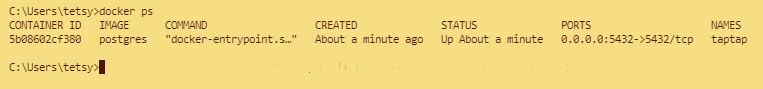
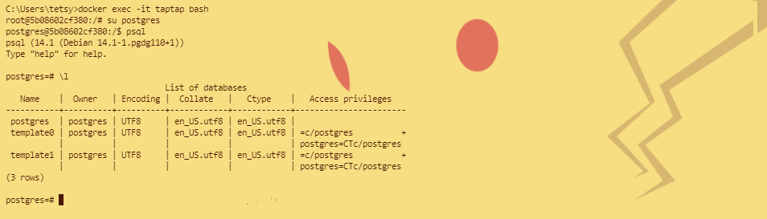
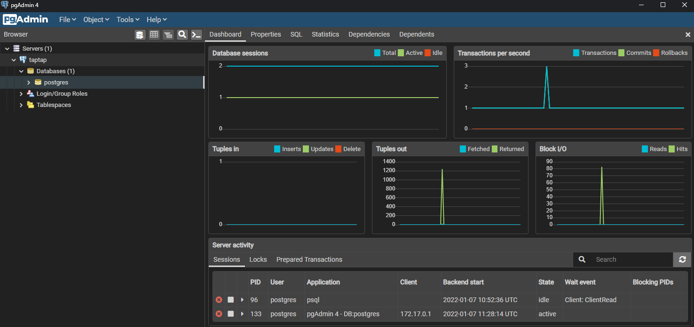

### Установка СУБД PostgreSQL
>Цель: Создать кластер PostgreSQL в докере или на виртуальной машине, запустить сервер и подключить клиента

1. Установили Docker, скачали и запустили контейнер postgres'a

2. Развернули postgres и подключились через консоль

3. Подключились к серверу используя pgAdmin
