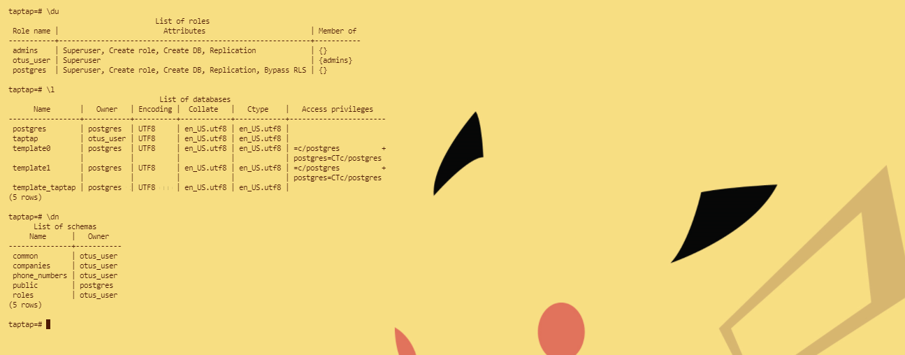

### DDL скрипты для postgres
>Цель:  
>1. Реализовать спроектированную схему в postgres
>2. Используя операторы DDL создайте на примере схемы интернет-магазина или своего проекта

* Создаем роль(группу) для администратора - admins, создаем пользователя otus_user и даем ему группу admins. Создаем БД
taptap, коннектимся к ней и создаем схемы для таблиц.

* Создаем таблицы, распределяя по ранее созданным схемам. Скриншот из HeidiSQL т.к. более нагляднее видно что всё на месте ^_^

* [Sql файл](src/taptap.sql)
