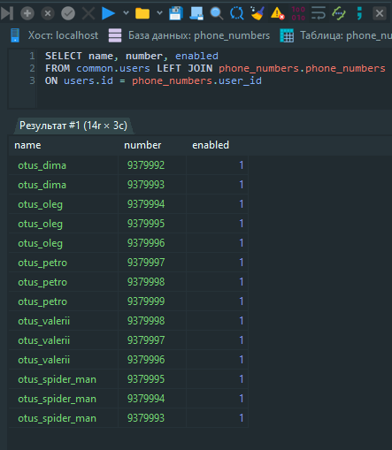
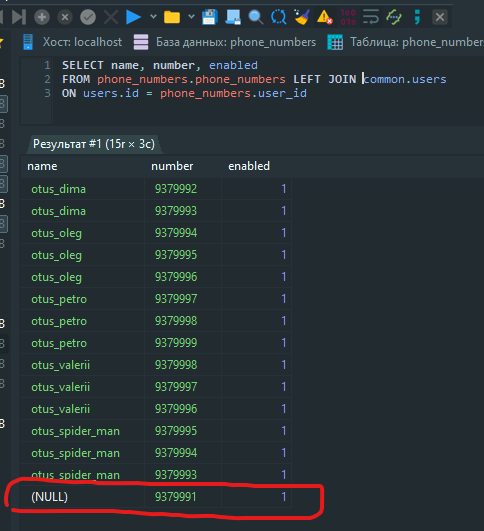
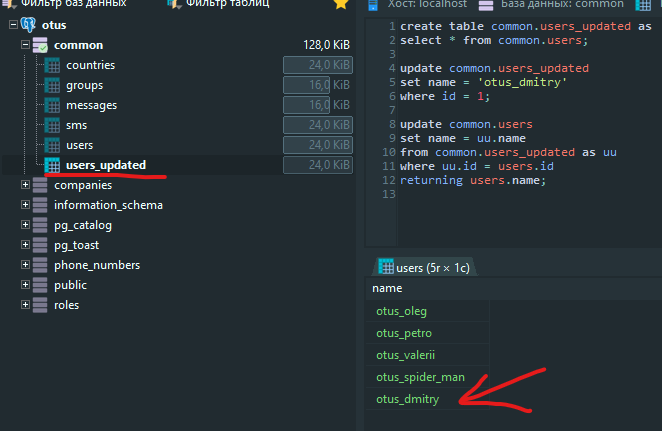
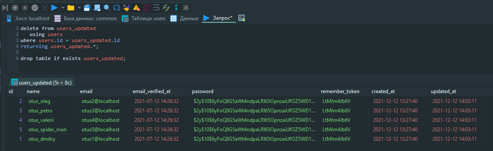

###  DML: вставка, обновление, удаление, выборка данных 
>Цель:  
>1. Написать запрос с конструкциями SELECT, JOIN 
>2. Написать запрос с добавлением данных INSERT INTO
>3. Написать запрос с обновлением данных с UPDATE FROM 
>4. Использовать using для оператора DELETE

* Дорабатываем нашу [схему](src/taptap.sql), добавляем [ключи и индексы](src/index.sql)
* Наполняем БД [данными](src/data.sql)
    * [countries](src/data/countries.sql)
    * [groups](src/data/groups.sql)
    * [messages](src/data/messages.sql)
    * [sms](src/data/sms.sql)
    * [users](src/data/users.sql)
    * [companies](src/data/companies.sql)
    * [companies_messages](src/data/companies_messages.sql)  
    * [phone_numbers](src/data/phone_numbers.sql)
    * [phone_numbers_companies](src/data/phone_numbers_companies.sql)       
    * [phone_numbers_groups](src/data/phone_numbers_groups.sql)  

### Домашнее задание

    1. Напишите запрос по своей базе с регулярным выражением, добавьте пояснение, что вы хотите найти.
    
    select *
    from common.messages
    where message LIKE 'Тестовое%';
  
    Данным запросом найдем тестовые сообщения в таблице messages
    
    2. Напишите запрос по своей базе с использованием LEFT JOIN и INNER JOIN, как порядок соединений в FROM влияет на результат? Почему?
    
    SELECT name, number, enabled
    FROM phone_numbers.phone_numbers LEFT JOIN common.users
    ON users.id = phone_numbers.user_id
    
    SELECT name, number, enabled
    FROM common.users INNER JOIN phone_numbers.phone_numbers
    ON users.id = phone_numbers.user_id
    
    Для INNER JOIN, так как строки попадают в результирующую таблицу если условие истинно, то видимого различия не увидел.
    Для LEFT JOIN есть видимая разница в порядке соединений 
    
 

    3. Напишите запрос на добавление данных с выводом информации о добавленных строках.
    
    insert into common.countries
    (id, name, title)
    VALUES(21, 'BF', 'БУРКИНА-ФАСО')
    returning name, title;
    
    4. Напишите запрос с обновлением данных используя UPDATE FROM.

    5. Напишите запрос для удаления данных с оператором DELETE используя join с другой таблицей с помощью using. 

    
    6. Приведите пример использования утилиты COPY (по желанию)
    
    COPY можно использовать как для переноса данных между таблицами, так и для переноса данных из таблиц в файл (COPY TO) и наоборот (COPY FROM).
    COPY TO удобно использовать для выборки в файл необходимых данных, которые соответствуют определнному результатоу запроса.
    
    

