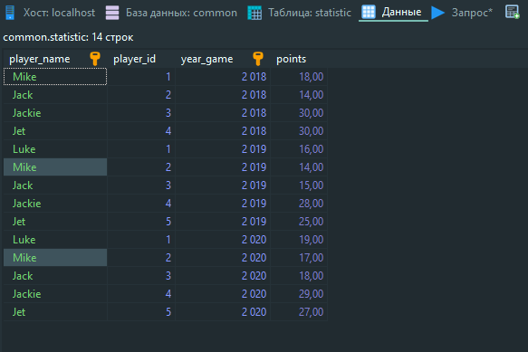
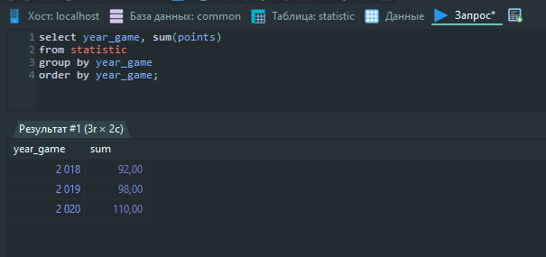
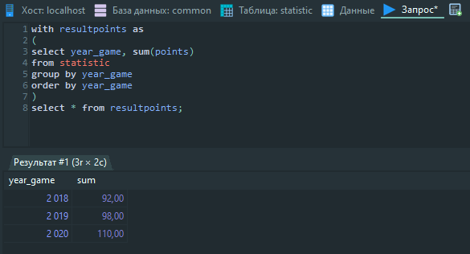
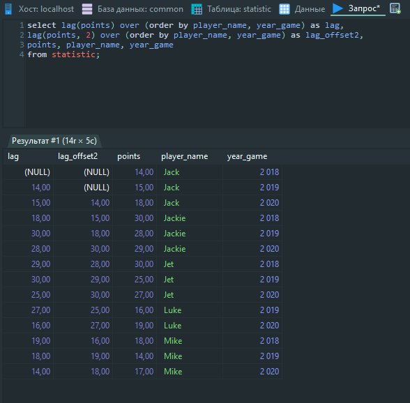

# Домашнее задание
## DML: агрегация и сортировка, CTE, аналитические функции
Цель: Научиться использовать функцию LAG и CTE

Описание/Пошаговая инструкция выполнения домашнего задания:

- Создайте таблицу и наполните ее данными

``` sql
CREATE TABLE statistic( 
    player_name VARCHAR(100) NOT NULL, 
    player_id INT NOT NULL, 
    year_game SMALLINT NOT NULL CHECK (year_game > 0), 
    points DECIMAL(12,2) CHECK (points >= 0), 
    PRIMARY KEY (player_name,year_game) 
);
```

``` sql
INSERT INTO statistic(player_name, player_id, year_game, points) 
VALUES 
    ('Mike',1,2018,18), 
    ('Jack',2,2018,14), 
    ('Jackie',3,2018,30), 
    ('Jet',4,2018,30), 
    ('Luke',1,2019,16), 
    ('Mike',2,2019,14), 
    ('Jack',3,2019,15), 
    ('Jackie',4,2019,28), 
    ('Jet',5,2019,25), 
    ('Luke',1,2020,19), 
    ('Mike',2,2020,17), 
    ('Jack',3,2020,18), 
    ('Jackie',4,2020,29), 
    ('Jet',5,2020,27);
```



-           Написать запрос суммы очков с группировкой и сортировкой по годам 


-           Написать cte показывающее тоже самое 


-           Используя функцию LAG вывести кол-во очков по всем игрокам за текущий код и за предыдущий. 



   


