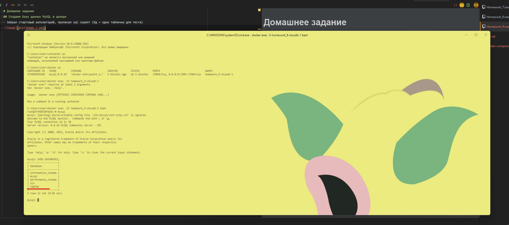

# Домашнее задание
## Создаем базу данных MySQL в докере
- Забрал стартовый репозиторий, прописал sql скрипт (бд + одна табличка для теста), docker-compose. Как контейнер стартовал - подключаемся, 
заходим в mysql  и проверяем есть ли наш taptap.
 